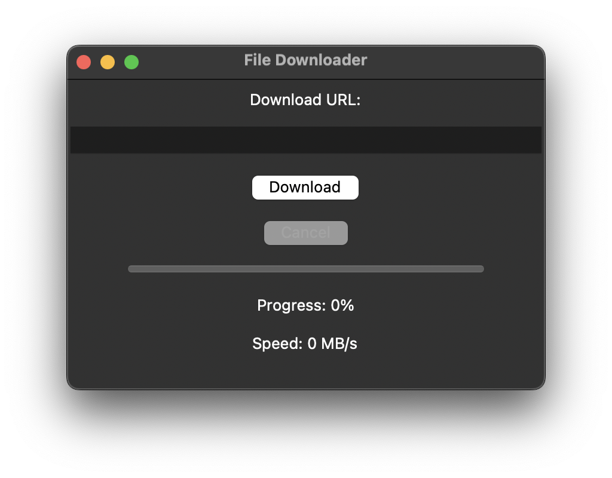
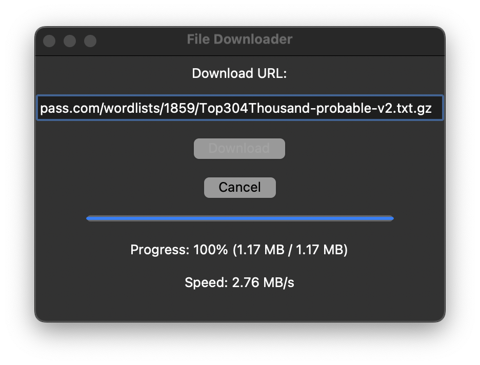

# File Downloader

File Downloader is a Python script that allows you to download files from the internet using a simple GUI.

## Installation

1. Clone the repository

2. Navigate to the project directory

3. Install dependencies using requirments.txt

## Usage

To run the File Downloader, execute the following command:

Then, enter the URL of the file you want to download and click the "Download" button.

## Screenshots

